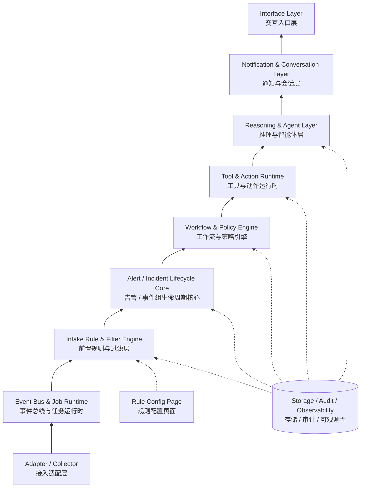

# Hubble

> 一个面向企业告警场景的通用告警机器人框架：接入告警、理解告警、调用工具、推送结论，并在群聊中继续追问和处置。

Hubble 的目标不是再做一个简单的 Webhook 转发器，而是做一个可插拔的 **AI AlertOps Runtime**。

当前架构已经升级到 V2：**事件和告警生命周期是主干，大模型是增强能力**。也就是说，即使没有大模型，Hubble 也应该能完成告警接入、前置过滤、去重、分组、路由、静默、升级和推送；当大模型可用时，再增强告警摘要、根因推断、影响面判断、工具调用和群聊追问。

## 文档

- [架构设计 V2](docs/architecture.md)
- [层间 API 契约设计](docs/layer-contracts.md)
- [Task Plan 与验收标准](docs/tasks.md)
- [Execution Log](docs/execution-log.md)
- [开源项目参考分析](docs/reference-projects.md)
- [插件接口约定](docs/plugin-contract.md)
- [HTTP Tool 使用说明](docs/http-tool.md)
- [Roadmap](docs/roadmap.md)

## 能力目标

- 支持 Webhook、轮询任务、自定义数据源等多种告警接入方式。
- 支持 Prometheus Alertmanager webhook batch payload。
- 支持前置规则过滤：drop、allow、tag、rewrite、低价值告警拦截。
- 支持独立的前置规则配置页面、dry-run 测试和命中统计。
- 支持告警归一化、指纹、去重、分组、静默、抑制、升级和 Incident 生命周期。
- 支持 Incident 人工确认、恢复和重新打开。
- 支持 YAML Policy DSL 配置路由、分析、工具增强和审批策略。
- 支持 OpenAI-compatible 模型接口，并在异常时自动回退到 Echo 分析。
- 引入大模型对告警进行摘要、分级、归因、降噪和处置建议生成。
- 提供工具和动作运行时，可接入日志、数据库、监控接口、CI/CD、知识库等内部系统。
- 支持只读 HTTP Tool 查询内部 API，并在模型分析前作为上下文增强。
- 支持 Prometheus instant / range query 工具。
- 支持飞书、企业微信、钉钉、Slack、通用 Webhook 等推送通道。
- 支持飞书自定义机器人 webhook 推送，支持可选签名 secret。
- 支持会话监听，在可回复的群聊环境中继续追问、补充上下文和执行工具。

## 架构 V2



```text
Adapter / Collector
  → Event Bus & Job Runtime
  → Intake Rule & Filter Engine
  → Alert / Incident Lifecycle Core
  → Workflow & Policy Engine
  → Tool & Action Runtime
  → Reasoning & Agent Layer
  → Notification & Conversation Layer
  → Interface Layer
```

## 当前重构状态

主链路已经切到事件驱动 runtime，并新增前置规则 Gate：

```text
Adapter
→ EventEnvelope(alert.received)
→ IntakeDecision
→ EventEnvelope(alert.ingested) | EventEnvelope(alert.filtered)
→ AlertLifecycleResult
→ Incident
→ PolicyDecision
→ ToolResult[]
→ Analysis
→ ChannelMessage
```

已落地模块：

```text
src/hubble/adapters     Adapter + GenericWebhookAdapter + AlertmanagerWebhookAdapter
src/hubble/events       EventEnvelope + InMemoryEventBus
src/hubble/intake       IntakeRule + IntakeRuleEngine + dry-run + hit stats
src/hubble/alerts       Alert + AlertLifecycleService
src/hubble/incidents    Incident + IncidentLifecycleService + state transitions
src/hubble/policies     PolicyDecision + PolicyEngine + YAML Policy DSL
src/hubble/tools        ToolSpec + ToolContext + ToolResult + ToolRegistry + HttpTool + PrometheusQueryTool
src/hubble/reasoning    Analysis + Echo + OpenAI-compatible provider + tool context fallback
src/hubble/channels     ChannelAdapter + Console + Feishu webhook adapter
src/hubble/runtime.py   Event-driven HubbleRuntime
```

## 最小运行方式

```bash
pip install -e .
uvicorn hubble.server:app --reload
```

也可以指定配置文件：

```bash
HUBBLE_CONFIG=configs/hubble.example.yaml uvicorn hubble.server:app --reload
```

启用 OpenAI-compatible 模型：

```bash
export HUBBLE_MODEL_BASE_URL=https://api.example.com/v1
export HUBBLE_MODEL_API_KEY=your-api-key
export HUBBLE_MODEL_NAME=your-model
HUBBLE_CONFIG=configs/hubble.example.yaml uvicorn hubble.server:app --reload
```

需要同时在配置中启用：

```yaml
model:
  providers:
    - name: openai-compatible
      type: openai_compatible
      enabled: true
      base_url_env: HUBBLE_MODEL_BASE_URL
      api_key_env: HUBBLE_MODEL_API_KEY
      model_env: HUBBLE_MODEL_NAME
      timeout_seconds: 20
```

启用 HTTP Tool：

```bash
export HUBBLE_QUERY_LOGS_URL=https://logs.example.internal/query
export HUBBLE_QUERY_LOGS_TOKEN=your-internal-token
HUBBLE_CONFIG=configs/hubble.example.yaml uvicorn hubble.server:app --reload
```

配置一个只读 HTTP 工具，并在 Policy DSL 中通过 `enrich_tools` 引用：

```yaml
tools:
  enabled: true
  registry:
    - name: query_logs
      type: http
      enabled: true
      description: Query recent logs from an internal log service.
      method: POST
      url_env: HUBBLE_QUERY_LOGS_URL
      bearer_token_env: HUBBLE_QUERY_LOGS_TOKEN
      body_template:
        service: "{service}"
        env: "{env}"
        incident_id: "{incident.id}"
        alert_id: "{alert.id}"
      timeout_seconds: 10
      dangerous: false
      sensitive_fields: [authorization, token, password, secret]

policies:
  rules:
    - name: payment-critical-route
      match:
        labels.service: payment-api
        severity: critical
      should_analyze: true
      enrich_tools: [query_logs]
```

启用 Prometheus Tool：

```bash
export HUBBLE_PROMETHEUS_BASE_URL=https://prometheus.example.internal
export HUBBLE_PROMETHEUS_TOKEN=optional-token
HUBBLE_CONFIG=configs/hubble.example.yaml uvicorn hubble.server:app --reload
```

配置示例：

```yaml
tools:
  enabled: true
  registry:
    - name: query_prometheus
      type: prometheus
      enabled: true
      base_url_env: HUBBLE_PROMETHEUS_BASE_URL
      bearer_token_env: HUBBLE_PROMETHEUS_TOKEN
      timeout_seconds: 10

policies:
  rules:
    - name: payment-critical-route
      match:
        labels.service: payment-api
        severity: critical
      enrich_tools: [query_prometheus]
```

可以手动查看和执行已注册工具：

```bash
curl http://127.0.0.1:8000/tools

curl -X POST http://127.0.0.1:8000/tools/query_prometheus/run \
  -H 'Content-Type: application/json' \
  -d '{"params":{"query":"up"}}'

curl -X POST http://127.0.0.1:8000/tools/query_prometheus/run \
  -H 'Content-Type: application/json' \
  -d '{"params":{"query":"rate(http_requests_total[5m])","start":"100","end":"200","step":"30s"}}'
```

启用飞书推送：

```bash
export HUBBLE_FEISHU_WEBHOOK_URL=https://open.feishu.cn/open-apis/bot/v2/hook/xxx
export HUBBLE_FEISHU_WEBHOOK_SECRET=optional-sign-secret
HUBBLE_CONFIG=configs/hubble.example.yaml uvicorn hubble.server:app --reload
```

需要同时在配置中启用，并在 Policy DSL 中把 `channels` 指向该通道：

```yaml
notifiers:
  channels:
    - name: feishu-sre
      type: feishu
      enabled: true
      webhook_url_env: HUBBLE_FEISHU_WEBHOOK_URL
      secret_env: HUBBLE_FEISHU_WEBHOOK_SECRET
      timeout_seconds: 10

policies:
  rules:
    - name: payment-critical-route
      match:
        labels.service: payment-api
        severity: critical
      channels: [feishu-sre]
```

发送测试告警：

```bash
curl -X POST http://127.0.0.1:8000/webhook/demo \
  -H 'Content-Type: application/json' \
  -d @examples/webhook_payload.json
```

发送 Alertmanager 示例告警：

```bash
curl -X POST http://127.0.0.1:8000/webhook/alertmanager/prometheus \
  -H 'Content-Type: application/json' \
  -d @examples/alertmanager_payload.json
```

前置规则配置页面：

```text
http://127.0.0.1:8000/admin/intake-rules
```

当前 API：

```text
GET    /healthz
POST   /webhook/{source}
POST   /webhook/alertmanager/{source}
GET    /alerts
GET    /incidents
POST   /incidents/{id}/ack
POST   /incidents/{id}/resolve
POST   /incidents/{id}/reopen
GET    /tools
POST   /tools/{tool_name}/run
GET    /intake-rules
POST   /intake-rules
POST   /intake-rules/dry-run
DELETE /intake-rules/{rule_id}
GET    /admin/intake-rules
```

`GET /intake-rules` 会返回规则命中统计，例如 `matched_count`、`filtered_count`、`tag_count`、`rewrite_count` 和 `last_matched_at`。

## Policy DSL 示例

```yaml
policies:
  rules:
    - name: payment-critical-route
      enabled: true
      priority: 10
      match:
        labels.service: payment-api
        labels.env: prod
        severity: critical
      should_notify: true
      should_analyze: true
      channels: [console]
      enrich_tools: [query_logs, query_prometheus]
      escalation_channels: [console]
      require_approval: false
```

## 第一阶段目标

1. `EventEnvelope`：统一事件信封。
2. `IntakeRule`：前置过滤、打标、重写、dry-run 和命中统计。
3. `Alert`：统一告警对象和 fingerprint。
4. Alertmanager-compatible webhook parser。
5. Alert dedup / group_by 简化版。
6. Console + 飞书 ChannelAdapter。
7. 模型结构化分析。
8. Prometheus / Log query tools。
9. 飞书群聊 `/explain` 和 `/logs`。

## 设计原则

- **生命周期优先**：先把 Alert / Incident 状态机做好，再引入模型增强。
- **前置过滤优先**：低价值、测试环境、已知噪音告警应尽早过滤，避免进入后续昂贵链路。
- **插件优先**：所有接入、模型、工具、动作、通道都通过统一接口注册。
- **结构化优先**：模型输出必须尽可能结构化，方便推送、审计和自动化动作。
- **安全优先**：工具默认只读，Action 必须显式授权、审计和二次确认。
- **降级优先**：没有大模型时也能作为普通告警路由器运行。
- **ChatOps 优先**：重点服务飞书、企微这类可追问的团队协作场景。
- **云原生友好**：后续支持 Docker、Kubernetes、Helm、Prometheus Metrics。

## License

TBD
