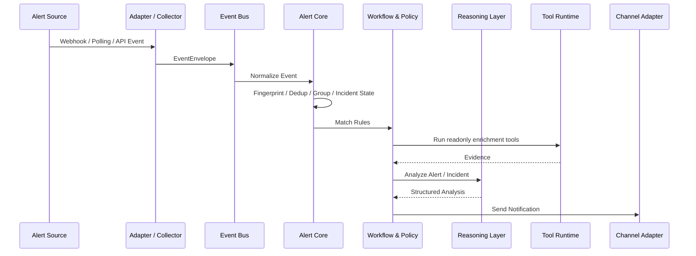
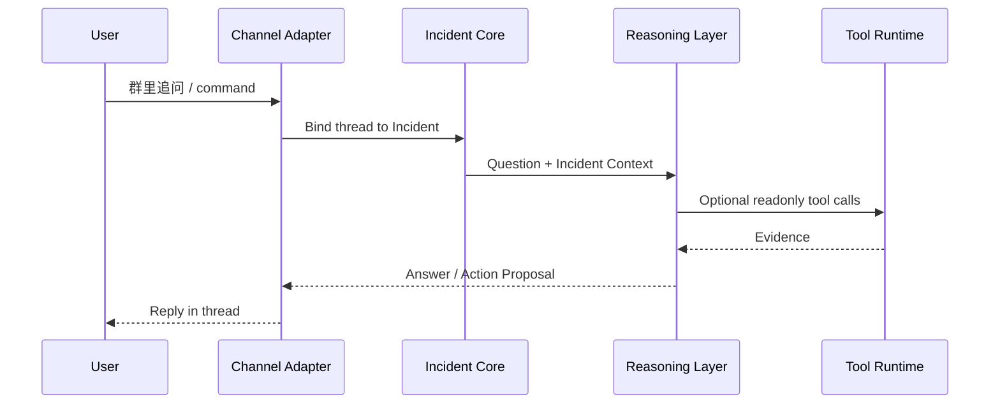
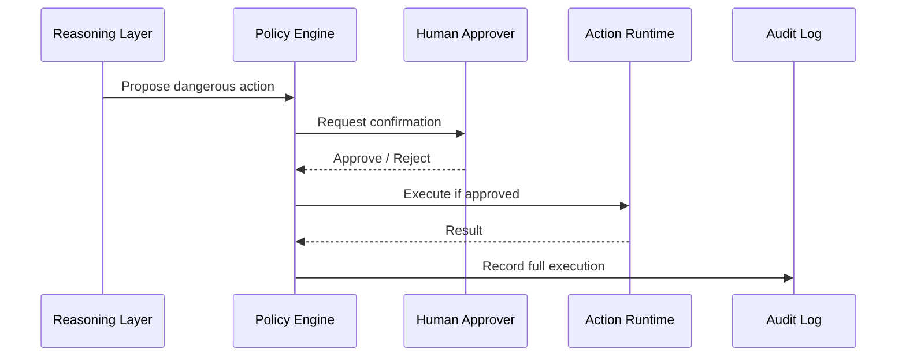

# Hubble 架构设计 V2

Hubble 的目标不是做一个“Webhook + LLM + 飞书推送”的简单串联工具，而是做一个面向告警生命周期的 **AI-native AlertOps Runtime**。

第一版架构里的五个部分——接入层、模型调度层、工具层、推送层、会话层——方向是对的，但还不够完整。优化后的核心判断是：

> **告警系统的主干应该是事件、告警和事件组生命周期；大模型是增强分析与处置能力，不应该成为唯一主链路。**

这样即使模型不可用，Hubble 仍然可以完成告警接入、去重、分组、路由、静默、升级和推送；模型可用时，再增强摘要、归因、影响面判断和处置建议。

## 1. 参考项目与借鉴点

| 项目 / 标准 | 可借鉴点 | Hubble 的取舍 |
| --- | --- | --- |
| Prometheus Alertmanager | 去重、分组、路由、silence、inhibition、高可用 | 作为告警核心的基础能力，不重复造复杂监控系统 |
| Grafana OnCall OSS | 值班、路由、升级链、ChatOps、通知偏好 | 参考产品模型；注意其 OSS 仓库已归档，不作为依赖 |
| Keep | AIOps、去重、抽取、映射、维护窗口、服务拓扑、工作流、Provider | 重点参考 AIOps 结构；Hubble 差异化走 ChatOps-first + Agentic 工具调用 |
| StackStorm | sensors、triggers、actions、rules、workflows、packs、audit trail | 工具与自动化层重点参考，尤其是“触发器 → 规则 → 动作/工作流” |
| CloudEvents | 通用事件信封 | 作为内部 EventEnvelope 设计参考，降低接入源差异 |
| OpenTelemetry | 日志、指标、链路追踪的统一相关性 | 工具层查询日志/指标/trace 时参考其语义和关联方式 |
| LangGraph | 长运行、有状态、human-in-the-loop agent | 后期可作为会话处置和多步推理的可选 Agent Runtime |

## 2. 优化后的总体架构

```text
┌──────────────────────────────────────────────────────────────────────┐
│                           Interface Layer                            │
│     Web UI / CLI / REST API / Feishu / WeCom / Slack / Web Chat       │
└───────────────────────────────▲──────────────────────────────────────┘
                                │
┌───────────────────────────────┴──────────────────────────────────────┐
│                Notification & Conversation Layer                      │
│       推送、线程回复、群聊监听、命令、人工确认、通知偏好                  │
└───────────────────────────────▲──────────────────────────────────────┘
                                │
┌───────────────────────────────┴──────────────────────────────────────┐
│                    Reasoning & Agent Layer                            │
│       LLM 分析、RAG、工具规划、多轮上下文、结构化输出、置信度             │
└───────────────────────────────▲──────────────────────────────────────┘
                                │
┌───────────────────────────────┴──────────────────────────────────────┐
│                    Tool & Action Runtime                              │
│       查日志、查指标、查 Trace、查 DB、查发布、查知识库、执行动作          │
└───────────────────────────────▲──────────────────────────────────────┘
                                │
┌───────────────────────────────┴──────────────────────────────────────┐
│                    Workflow & Policy Engine                           │
│       规则、升级链、抑制、静默、审批、自动化编排、危险动作拦截             │
└───────────────────────────────▲──────────────────────────────────────┘
                                │
┌───────────────────────────────┴──────────────────────────────────────┐
│                 Alert / Incident Lifecycle Core                       │
│       归一化、指纹、去重、分组、关联、状态机、事件组、生命周期             │
└───────────────────────────────▲──────────────────────────────────────┘
                                │
┌───────────────────────────────┴──────────────────────────────────────┐
│                    Event Bus & Job Runtime                            │
│       队列、定时任务、重试、限流、幂等、死信队列、异步 Worker              │
└───────────────────────────────▲──────────────────────────────────────┘
                                │
┌───────────────────────────────┴──────────────────────────────────────┐
│                    Adapter / Collector Layer                          │
│       Webhook、Polling、Prometheus、Grafana、Sentry、云厂商、自定义源      │
└──────────────────────────────────────────────────────────────────────┘

┌──────────────────────────────────────────────────────────────────────┐
│                    Storage / Audit / Observability                    │
│       PostgreSQL、Redis、对象存储、审计日志、Metrics、Trace、回放          │
└──────────────────────────────────────────────────────────────────────┘
```

## 3. 为什么这样调整

### 3.1 接入层不应该直接连模型

原来的链路容易变成：

```text
Webhook → LLM → Tool → Push
```

这个链路演示很快，但长期会有问题：

- 模型失败时，整个告警链路不可用。
- 无法很好做去重、聚合、静默、升级。
- 多个告警无法沉淀为 incident。
- 群聊追问缺少可绑定的生命周期对象。

优化后应该是：

```text
Event → Alert → Incident → Policy / Workflow → Reasoning → Notification / Conversation
```

模型只是其中一个可插拔能力，而不是全部。

### 3.2 “推送层”和“会话层”应该合并为交互层

飞书、企微、Slack 既能推送，也能接收用户回复。它们不应该被拆成两个完全独立系统，而应该抽象为：

```text
ChannelAdapter
├── send(notification)
├── reply(thread, message)
├── listen(handler)
└── parse_command(message)
```

对于只能发不能回的渠道，比如普通 Webhook，可以只实现 `send`。对于飞书、企微、Slack，可以同时实现 `send + listen + reply`。

### 3.3 工具层要分成 Tool 和 Action

不是所有“工具调用”风险都一样。

建议拆成：

```text
Tool      = 只读查询，如查日志、查指标、查 DB、查知识库
Action    = 有副作用操作，如重启服务、扩容、回滚、创建工单、静默告警
Workflow  = 多个 Tool / Action 的编排
```

默认策略：

- 只读 Tool 可以自动执行。
- Action 默认需要人工确认。
- 高危 Action 必须二次确认 + RBAC + 审计。
- 所有 Tool / Action 都必须有超时、参数 schema、脱敏和执行记录。

### 3.4 增加 Workflow & Policy Engine

这是原架构缺失但非常关键的一层。

它负责：

- 告警路由：哪个团队、哪个群、哪个值班人。
- 告警抑制：主故障存在时抑制从属故障。
- 静默窗口：发布窗口、维护窗口、已知问题。
- 升级链：未确认多久后升级给谁。
- 自动处置：满足条件时执行只读诊断或低风险动作。
- 人工确认：危险动作前让群里负责人确认。

规则示例：

```yaml
rules:
  - name: critical-payment-alert
    when:
      labels.service: payment-api
      severity: critical
    group_by: [service, env, region]
    route_to: [feishu-payment-sre]
    enrich:
      - query_recent_deployments
      - query_error_logs
      - query_prometheus_metrics
    require_ai_analysis: true
    escalation:
      after: 10m
      to: [feishu-sre-leads]
```

## 4. 核心数据模型

### 4.1 EventEnvelope

所有外部输入先进入统一事件信封。这里参考 CloudEvents，但不强制用户使用 CloudEvents。

```text
EventEnvelope
├── id
├── source
├── type
├── subject
├── time
├── data
├── datacontenttype
├── trace_id
├── tenant_id
└── extensions
```

### 4.2 Alert

Alert 是单条告警对象。

```text
Alert
├── id
├── source
├── title
├── description
├── severity
├── status                 # firing / resolved / acknowledged / suppressed
├── labels
├── annotations
├── fingerprint
├── starts_at
├── ends_at
├── raw_event_id
└── incident_id
```

### 4.3 Incident

Incident 是一组相关 Alert 的聚合对象。Hubble 真正应该围绕 Incident 做会话和处置。

```text
Incident
├── id
├── title
├── severity
├── status                 # open / investigating / mitigated / resolved
├── alert_fingerprints
├── affected_services
├── owner_team
├── timeline
├── current_summary
├── last_analysis_id
└── created_at / updated_at / resolved_at
```

### 4.4 Analysis

模型分析结果必须结构化，不能只存一段自然语言。

```text
Analysis
├── id
├── alert_id / incident_id
├── summary
├── severity_assessment
├── possible_causes
├── impact
├── evidence
├── recommended_actions
├── requested_tools
├── confidence
├── model_provider
├── prompt_version
└── raw_response
```

### 4.5 Execution

每一次工具、动作、工作流执行都要记录。

```text
Execution
├── id
├── type                   # tool / action / workflow
├── name
├── params
├── status                 # pending / running / succeeded / failed / blocked
├── requested_by           # model / user / rule
├── approved_by
├── result
├── elapsed_ms
└── audit_metadata
```

## 5. 关键运行链路

### 5.1 告警进入链路



### 5.2 群聊追问链路



### 5.3 危险动作链路



## 6. 模块拆分建议

```text
src/hubble/
├── adapters/              # 外部系统适配器：Webhook、飞书、企微、Slack、Sentry 等
├── events/                # EventEnvelope、事件总线、重试、死信队列
├── alerts/                # Alert 归一化、指纹、去重、状态机
├── incidents/             # Incident 聚合、时间线、生命周期
├── policies/              # 路由、静默、抑制、升级、审批策略
├── workflows/             # 多步编排，参考 StackStorm rules/workflows
├── reasoning/             # LLM、Prompt、RAG、结构化输出、Agent Runtime
├── tools/                 # 只读工具
├── actions/               # 有副作用动作
├── channels/              # 推送 + 会话统一适配器
├── storage/               # PostgreSQL、Redis、内存实现
├── audit/                 # 模型调用、工具调用、动作执行审计
└── server.py
```

第一版代码可以继续保留当前简单结构，但后续建议从 `notifiers/session/ingress` 逐步迁移到 `adapters/events/channels`，这样抽象会更稳。

## 7. MVP 应该怎么收敛

不要一开始就做完整平台。建议 Hubble MVP 只做 4 条闭环：

### MVP-1：稳定告警入口

- 通用 Webhook。
- Prometheus Alertmanager parser。
- Alert fingerprint。
- 简单 dedup。
- Console / Feishu 推送。

### MVP-2：AI 分析闭环

- OpenAI-compatible model provider。
- Prompt versioning。
- Structured Analysis。
- 模型失败 fallback。

### MVP-3：工具增强闭环

- HTTP tool。
- Prometheus query tool。
- Loki / Elasticsearch log query tool。
- 工具结果脱敏。
- 工具调用审计。

### MVP-4：ChatOps 闭环

- 飞书群消息监听。
- thread ↔ incident 绑定。
- `/explain`、`/logs 10m`、`/ack`、`/silence 30m`。
- 危险动作只提出建议，不自动执行。

## 8. 推荐技术选型

### 单体开发模式

适合开源早期：

```text
FastAPI + APScheduler + PostgreSQL/SQLite + Redis optional + Pydantic
```

### 可扩展部署模式

适合企业内部：

```text
API Server + Worker + Event Bus + PostgreSQL + Redis + Object Storage
```

### 事件总线选择

- 单机 / MVP：内存队列或 Redis Streams。
- 企业部署：NATS / Kafka / RabbitMQ 任选其一。
- Kubernetes 场景：后续可考虑 CloudEvents / Knative Eventing 兼容。

## 9. Hubble 的定位差异

Hubble 不建议直接做成 Keep 的复制品，也不建议做成 Alertmanager 的 Python 版。

更好的定位是：

> **面向中文团队和 ChatOps 场景的 AI 告警分析与处置助手。**

核心差异：

- 比 Alertmanager 更懂上下文和会话。
- 比传统 OnCall 工具更轻量。
- 比通用 Agent 框架更聚焦告警场景。
- 比 AIOps 大平台更容易本地部署和二次开发。

## 10. 后续实现优先级

```text
P0: EventEnvelope + Alert fingerprint + Webhook parser
P1: Alertmanager-compatible grouping / silence / inhibition 简化版
P2: Feishu ChannelAdapter：推送 + 回复 + 命令
P3: OpenAI-compatible ReasoningProvider + Structured Analysis
P4: Tool Runtime：Prometheus / Logs / HTTP / Runbook
P5: Incident Core：alert group、timeline、thread binding
P6: Policy Engine：routing、escalation、approval
P7: Workflow Engine：多步诊断和半自动处置
```
