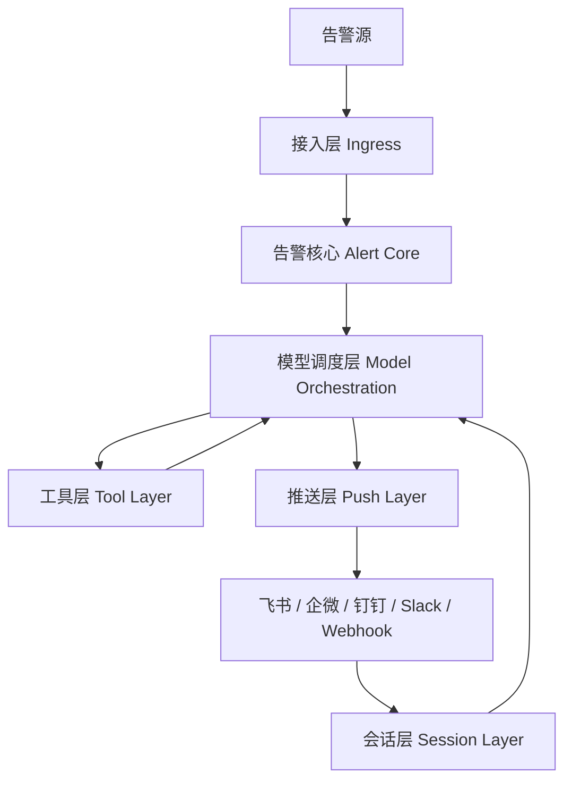
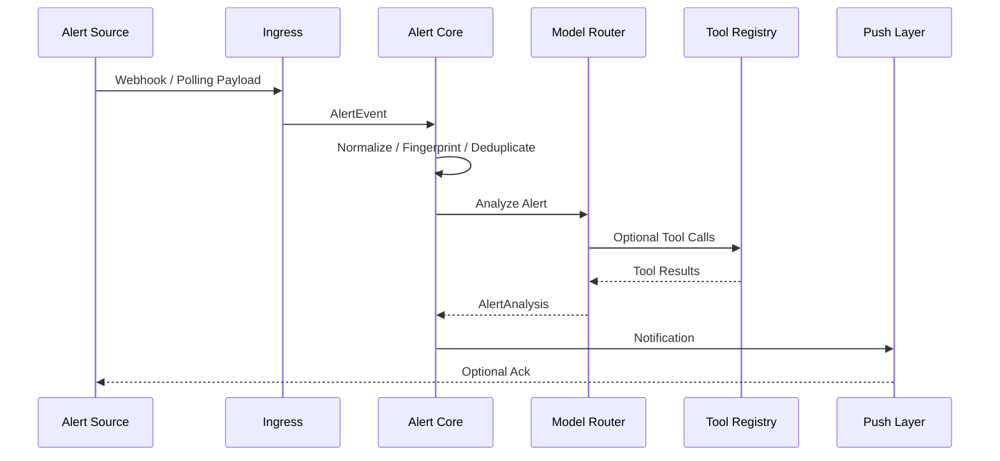
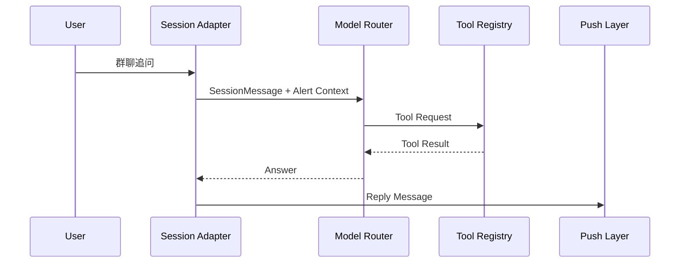

# Hubble 架构设计

Hubble 是一个通用告警机器人开源项目，定位为 **告警接入 + 大模型分析 + 工具调用 + 多通道推送 + 群聊会话处置** 的统一运行时。

## 1. 总体架构



Hubble 将所有输入都归一化为 `AlertEvent`，将模型分析结果归一化为 `AlertAnalysis`，将所有外部操作抽象为 `Tool`，将所有消息发送抽象为 `Notifier`，将所有可交互通道抽象为 `SessionAdapter`。

## 2. 接入层：Ingress Layer

接入层负责把外部事件变成统一的告警事件。

### 支持方式

- **Webhook 接入**：Prometheus Alertmanager、Grafana、Sentry、自研监控平台、CI/CD 系统等。
- **轮询任务接入**：定时查询数据库、HTTP API、日志平台、云厂商接口等。
- **自定义数据源插件**：用户实现 `Ingress` 接口即可接入任意来源。

### 职责边界

接入层只做三件事：

1. 接收原始数据。
2. 解析并归一化为 `AlertEvent`。
3. 交给核心引擎处理。

接入层不直接调用模型、不直接发消息、不直接执行工具，避免逻辑散落。

## 3. 告警核心：Alert Core

告警核心是 Hubble 的事件处理中心。

### 核心能力

- **归一化**：统一字段、时间、标签、来源。
- **指纹生成**：根据 source、title、labels 等生成稳定 fingerprint。
- **去重**：同一 fingerprint 在窗口期内合并。
- **聚合**：多个相关告警合并为一个 incident。
- **抑制**：维护窗口、已知问题、低价值告警可被抑制。
- **升级**：高严重级别或长时间未恢复的告警升级推送。
- **生命周期管理**：firing、acknowledged、resolved、suppressed。

### 推荐数据模型

```text
AlertEvent
├── id
├── source
├── title
├── description
├── severity
├── status
├── labels
├── annotations
├── starts_at
├── ends_at
├── fingerprint
└── raw
```

## 4. 模型调度层：Model Orchestration Layer

模型调度层负责让大模型“理解告警”，但不让业务逻辑直接依赖某一家模型服务。

### 核心组件

- **ModelProvider**：适配不同模型服务，如 OpenAI-compatible API、本地模型、私有模型网关。
- **ModelRouter**：根据告警类型、成本、上下文长度、可靠性选择模型。
- **PromptTemplate**：不同任务使用不同 Prompt，如摘要、根因分析、影响面判断、处置建议。
- **ContextBuilder**：拼接告警、历史事件、日志摘要、监控指标、知识库内容。
- **StructuredOutputParser**：将模型结果解析为 `AlertAnalysis`。
- **AuditLogger**：记录模型输入输出，便于回放和排查。

### 模型输出建议

模型输出不应该只是一段自然语言，而应该包含：

```text
AlertAnalysis
├── summary              # 一句话说明发生了什么
├── severity             # 模型判断的严重级别
├── possible_causes      # 可能原因
├── impact               # 影响范围
├── recommended_actions  # 处置建议
├── tool_requests        # 希望调用的工具
├── confidence           # 置信度
└── raw_response         # 原始模型输出
```

## 5. 工具层：Tool Layer

工具层让模型可以获取更多上下文，而不是只根据告警文本瞎猜。

### 典型工具

- 查日志：Loki、Elasticsearch、ClickHouse、CloudWatch、自研日志平台。
- 查数据库：MySQL、PostgreSQL、Redis、MongoDB。
- 查监控：Prometheus、Grafana、云监控。
- 查接口：内部 HTTP API、服务健康检查。
- 查发布：GitHub、GitLab、CI/CD、Kubernetes Event。
- 查知识库：Runbook、故障复盘、值班手册、Notion、Confluence。

### 安全原则

- 默认只开放只读工具。
- 每个工具必须有超时、权限、参数校验和审计日志。
- 写操作必须标记为 `dangerous=true`，默认需要人工确认。
- 模型只能“请求调用工具”，真正执行由 Hubble 的安全执行器决定。

## 6. 推送层：Push Layer

推送层负责把分析结果发送到人能看到的地方。

### 支持通道

- 飞书机器人。
- 企业微信机器人。
- 钉钉机器人。
- Slack。
- Email。
- 通用 Webhook。

### 消息结构

推荐分为四块：

1. **发生了什么**：一句话摘要。
2. **严重程度**：来源级别 + 模型判断级别。
3. **可能原因与影响**：简洁列出。
4. **建议动作**：可执行的下一步。

## 7. 会话层：Session Layer

会话层解决“告警发出去之后还能继续问”的问题。

### 典型对话

- “这个告警影响哪些服务？”
- “查一下最近 10 分钟 payment 服务日志。”
- “和上次故障像不像？”
- “生成一个临时处理方案。”
- “把这个告警标记为已确认。”

### 会话设计

每条群聊消息需要绑定上下文：

```text
SessionMessage
├── channel
├── thread_id
├── sender_id
├── text
├── alert_id
├── incident_id
└── metadata
```

会话层不直接处理业务，而是把用户问题转成带上下文的模型请求，再由模型调度层和工具层完成回答。

## 8. 事件处理链路

### 告警进入链路



### 群聊追问链路



## 9. 部署形态

### 单体模式

适合早期和个人使用：

```text
FastAPI + APScheduler + SQLite/PostgreSQL + Redis optional
```

### 分布式模式

适合企业内部：

```text
API Server + Worker + Queue + PostgreSQL + Redis + Object Storage
```

后续可扩展：

- Docker Compose。
- Kubernetes Deployment。
- Helm Chart。
- Prometheus Metrics。
- OpenTelemetry Trace。

## 10. MVP 范围

第一版不要追求全自动闭环，重点做出可靠的“AI 告警分析助手”：

1. Webhook 接入。
2. 统一告警模型。
3. 模型摘要与建议。
4. 工具接口和一个示例工具。
5. 飞书/企微推送。
6. CLI 会话 Demo。
7. 配置文件驱动。
